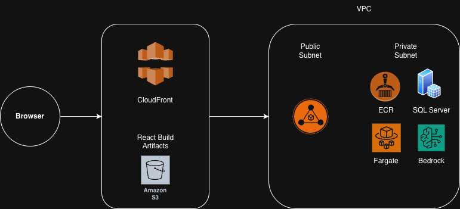
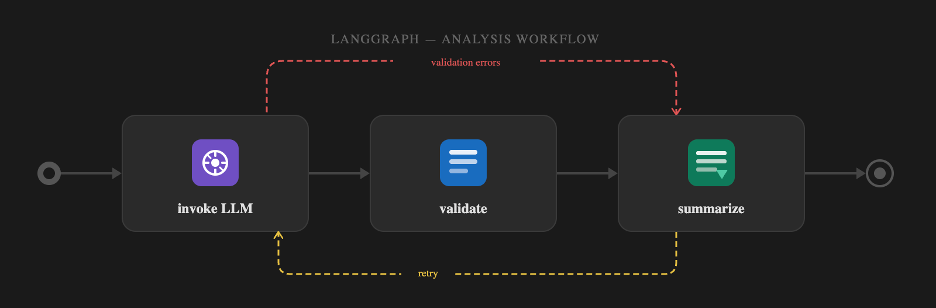

# IoT Maintenance Insight Dashboard

> An application that ingests manufacturing sensor data, runs an AI-powered risk analysis workflow, and surfaces maintenance predictions on a live dashboard.

---

## Table of Contents

1. [What It Does](#what-it-does)
2. [Tech Stack](#tech-stack)
3. [AWS Deployment via GitHub Actions](#aws-deployment-via-github-actions)
4. [Local Setup](#local-setup)
5. [Architecture](#architecture)
6. [How the AI Works](#how-the-ai-works)
7. [File Structure](#file-structure)
8. [Troubleshooting](#troubleshooting)

---

## What It Does

1. **Ingests** manufacturing floor sensor logs (temperature, vibration, status) from a CSV upload
2. **Runs** an LLM-powered risk analysis workflow (LangGraph, AWS Bedrock) to identify the top at-risk machines
3. **Validates** AI output with a two-stage schema + logic contradiction checker — retries automatically on failure
4. **Displays** raw logs, AI-generated machine health cards, and sensor time-series charts on a live dashboard
5. **Answers** follow-up questions about fleet health via an SSE-streaming chat interface

---

## Tech Stack

| Layer | Technology |
|---|---|
| Backend | FastAPI (Python 3.12), SQLAlchemy async, aiosqlite |
| AI Workflow | LangGraph, LangChain, AWS Bedrock (Amazon Nova Lite) |
| Frontend | React 18, TypeScript, Vite, Tailwind CSS, shadcn/ui, Recharts |
| Containerisation | Docker, Docker Compose, Nginx |
| Infrastructure | AWS CDK (TypeScript) |
| Compute | AWS ECS Fargate |
| CDN / Storage | CloudFront + S3 |
| Registry | Amazon ECR |
| Networking | VPC, ALB, NAT Gateway |
| Secrets | AWS Secrets Manager |
| CI/CD | GitHub Actions |

---

## AWS Deployment via GitHub Actions

There are two ways to run this app: **AWS deployment** (production, via GitHub Actions) and **local setup** (Docker Compose). Follow the relevant section below.

The entire AWS infrastructure is managed with CDK and deployed with a single button click. No local AWS tools required.

1. **Fork** this repository to your GitHub account

2. **Add three GitHub Secrets** (Settings → Secrets and variables → Actions → New repository secret):

   | Secret name | Value |
   |---|---|
   | `AWS_ACCESS_KEY_ID` | Your IAM user access key |
   | `AWS_SECRET_ACCESS_KEY` | Your IAM user secret key |
   | `AWS_ACCOUNT_ID` | Your 12-digit AWS account number |

   The IAM user needs these permissions: `AdministratorAccess` (or a scoped policy covering CloudFormation, ECS, ECR, S3, CloudFront, Bedrock, IAM, VPC).

3. **Run the deploy workflow**:
   - Go to **Actions → Deploy IoT Dashboard → Run workflow → Run workflow**
   - The workflow takes ~10 minutes on a fresh account

4. **Get the app URL**:
   - When the workflow finishes, open the run summary — the CloudFront URL is printed there
   - Example: `https://d1abc123xyz.cloudfront.net`

5. **Tear everything down** when done:
   - Go to **Actions → Destroy IoT Dashboard → Run workflow → Run workflow**
   - All AWS resources are deleted; no charges continue after this

### GitHub Actions Workflows

| Workflow | Trigger | What it does |
|---|---|---|
| `ci.yml` | Push / PR to `main` | Lint, type-check, test (backend + frontend) |
| `deploy.yml` | Manual (`workflow_dispatch`) | Full from-scratch deploy of all AWS resources |
| `cd.yml` | PR merged to `main` | Rebuilds and redeploys backend image + frontend on existing infrastructure |
| `destroy.yml` | Manual (`workflow_dispatch`) | Tears down all AWS resources |

### Continuous Deployment — what happens on every PR merge to `main`

`cd.yml` runs automatically whenever a pull request is merged into `main`. It runs two jobs in parallel:

**Backend job:**
1. Builds a new Docker image tagged with the commit SHA and `latest`
2. Pushes both tags to ECR
3. Calls `aws ecs update-service --force-new-deployment` — ECS spins up a new Fargate task with the fresh image and drains the old one
4. Waits for the service to reach a stable state before the job completes

**Frontend job:**
1. Runs `npm ci && npm run build`
2. Syncs the `dist/` output to the S3 bucket (`--delete` removes stale files)
3. Issues a CloudFront `/*` cache invalidation so users get the latest build immediately

> **Note on the database:** ECS Fargate tasks have an ephemeral filesystem — each new deployment starts a fresh container with an empty SQLite database. For this demo, sensor data is re-ingested from the CSV after each deploy. In a production setup this would be replaced by an EFS-mounted volume or RDS instance.

---

## Local Setup

### Prerequisites

- [Docker Desktop](https://www.docker.com/products/docker-desktop/) (includes Docker Compose)
- An OpenAI API key **or** AWS credentials with Bedrock access

### 1. Clone the repo

```bash
git clone https://github.com/sanjeevmax6/iot_dashboard.git
cd iot_dashboard
```

### 2. Configure environment variables

```bash
cp .env.example .env
```

Open `.env` and set the following:

```env
# Choose your LLM provider
LLM_PROVIDER=openai

# If using OpenAI (recommended for local dev)
OPENAI_API_KEY=sk-...

# If using Bedrock instead
# AWS_ACCESS_KEY_ID=...
# AWS_SECRET_ACCESS_KEY=...
# BEDROCK_REGION=us-east-1
# BEDROCK_MODEL_ID=us.amazon.nova-lite-v1:0
```

### 3. Start the full stack

```bash
docker compose -f infra/docker-compose.yml up --build
```

This starts three containers:
- `backend` — FastAPI on port 8000
- `frontend` — React (served via Nginx)
- `nginx` — reverse proxy on port 80, routes `/api/*` to backend

Open the app at **http://localhost**

### 4. Load sample data

Either use the **Ingest CSV** button in the dashboard, or run:

```bash
curl -X POST http://localhost/api/logs/ingest \
  -F "file=@assets/manufacturing_floor_logs_1000.csv"
```

Then click **Analyze Fleet Health** to trigger the AI analysis.

---

## Architecture



---

## How the AI Works



The AI system has two independent components: a **batch analysis workflow** and a **streaming chat interface**.

### 1. Fleet Analysis Workflow (LangGraph)

When you click **Analyze Fleet Health**, this pipeline runs:

**Why the validation layer?** LLMs occasionally hallucinate machine IDs, assign a `risk_score` that contradicts the stated `risk_level`, or return results in the wrong order. Rather than silently accepting bad data, the validator catches these contradictions and feeds the exact errors back to the LLM as correction instructions, retrying up to `MAX_AI_RETRIES` times.

### 2. Intent Guard

Before every chat message is processed, a lightweight classifier call checks whether the message is on-topic (fleet/machine domain). Off-topic messages (weather, general knowledge, etc.) are refused with a canned message. This uses the same LLM but without tool calling — just a simple `ON_TOPIC` / `OFF_TOPIC` classification.

### 3. Streaming Chat (SSE)

The chat interface uses Server-Sent Events for token streaming. Session memory (conversation history) is held in-process per `session_id`. It resets on server restart — acceptable for this scope.

### 4. LLM Provider switching

The `LLM_PROVIDER` env var switches between OpenAI (local dev) and Bedrock (production) at startup. Both providers go through the same LangGraph graph — only the underlying `ChatModel` instance changes.

```
LLM_PROVIDER=openai   → ChatOpenAI  (gpt-4o-mini by default)
LLM_PROVIDER=bedrock  → ChatBedrock (us.amazon.nova-lite-v1:0 by default)
```

To use Claude on Bedrock instead of Nova, enable model access in the Bedrock console and set:
```env
BEDROCK_MODEL_ID=us.anthropic.claude-haiku-4-5-20251001-v1:0
```

---

## File Structure

```
iot_dashboard/
│
├── backend/                        FastAPI application + AI agent
│   ├── app/
│   │   ├── api/routes/             HTTP endpoints
│   │   │   ├── analysis.py         POST /api/analysis/run, GET /api/analysis/status
│   │   │   ├── chat.py             POST /api/analysis/chat/stream (SSE)
│   │   │   ├── logs.py             GET /api/logs, POST /api/logs/ingest
│   │   │   ├── machines.py         GET /api/machines
│   │   │   └── data.py             GET /api/data (sensor time-series)
│   │   ├── models/                 SQLAlchemy ORM models
│   │   ├── schemas/                Pydantic request/response schemas
│   │   ├── services/
│   │   │   ├── ingestion.py        CSV parsing + bulk DB insert
│   │   │   └── summarizer.py       SQL aggregation for AI input
│   │   ├── core/
│   │   │   ├── config.py           Settings (reads from .env)
│   │   │   └── database.py         Async SQLAlchemy engine setup
│   │   └── main.py                 FastAPI app, CORS, lifespan
│   │
│   ├── agent/                      LangGraph AI workflow
│   │   ├── graph.py                LangGraph state machine (invoke → validate → summarize)
│   │   ├── schemas.py              Pydantic output types (AnalysisOutput, MachineRisk)
│   │   ├── validator.py            Stage 2 logic contradiction checker
│   │   ├── prompts.py              System prompts + user prompt builder
│   │   ├── chat.py                 Streaming chat, intent guard, session memory
│   │   └── llm_rerouter.py         Provider switch (OpenAI ↔ Bedrock)
│   │
│   ├── tests/                      Pytest test suite (>80% coverage)
│   ├── Dockerfile                  Multi-stage build (builder + slim runtime)
│   └── requirements.txt
│
├── frontend/                       React + TypeScript SPA
│   ├── src/
│   │   ├── App.tsx                 Root component + routing
│   │   └── ...                     Pages, components, hooks, API clients
│   ├── Dockerfile                  Nginx-served production build
│   └── package.json
│
├── infra/
│   ├── docker-compose.yml          Local dev stack (backend + frontend + nginx)
│   ├── nginx/nginx.conf            Local reverse proxy config
│   └── cdk/                        AWS CDK (TypeScript)
│       ├── app.ts                  Stack entry point
│       └── lib/
│           ├── vpc-stack.ts        VPC, subnets, NAT Gateway
│           ├── ecr-stack.ts        ECR repository
│           ├── ecs-stack.ts        Fargate service, ALB, IAM roles, Secrets Manager
│           └── frontend-stack.ts   S3 bucket, CloudFront distribution (OAC)
│
├── .github/workflows/
│   ├── ci.yml                      Lint + test on every push/PR
│   ├── deploy.yml                  One-click full AWS deploy (manual trigger)
│   ├── cd.yml                      Update backend + frontend on PR merge to main
│   └── destroy.yml                 Tear down all AWS resources (manual trigger)
│
└── assets/
    └── manufacturing_floor_logs_1000.csv   Sample sensor data (1,000 rows)
```

---

## Troubleshooting

**1. ECS Circuit Breaker triggered on deploy**
**Symptom:** `ECS Deployment Circuit Breaker was triggered`
**Fix:** `deploy.yml` handles this automatically (deploys ECR first, builds with `--platform linux/amd64`, detects `ROLLBACK_COMPLETE` stacks). If deploying manually: deploy ECR → push image → deploy ECS.

**2. CDK bootstrap fails — missing S3 bucket**
**Symptom:** `No bucket named 'cdk-hnb659fds-assets-ACCOUNT-REGION'`
**Cause:** CDKToolkit stack exists but its S3 bucket was deleted (stack drift). `deploy.yml` handles this automatically.
```bash
aws cloudformation delete-stack --stack-name CDKToolkit --region us-east-1
aws cloudformation wait stack-delete-complete --stack-name CDKToolkit --region us-east-1
npx cdk bootstrap aws://ACCOUNT_ID/us-east-1
```

**3. Docker image platform mismatch**
**Symptom:** `image Manifest does not contain descriptor matching platform 'linux/amd64'`
**Fix:** Built on Apple Silicon without a target platform flag. Always use:
```bash
docker build --platform linux/amd64 -t my-image ./backend
```

**4. Bedrock model access denied**
**Symptom:** `AccessDeniedException: not authorized to perform bedrock:InvokeModel`
- Anthropic models require enabling in **AWS Console → Bedrock → Model access**. Nova (default) does not.
- Streaming chat requires `bedrock:InvokeModelWithResponseStream` — both actions are granted in `ecs-stack.ts`.

**5. Bedrock tool description validation error**
**Symptom:** `Invalid length for parameter toolConfig.tools[0].toolSpec.description, value: 0`
**Fix:** Nova requires non-empty descriptions on all Pydantic fields and class docstrings. Already applied in `agent/schemas.py`.

**6. Chat streaming produces garbled output**
**Symptom:** Chat tokens appear as `[object Object]`
**Fix:** Nova returns `chunk.content` as a list of content blocks, not a plain string. Handled in `agent/chat.py` via `isinstance(raw, list)` check.

**7. Stack stuck in ROLLBACK_COMPLETE**
**Symptom:** `Stack is in ROLLBACK_COMPLETE state and cannot be updated`
**Fix:** `deploy.yml` handles this automatically. Manually:
```bash
aws cloudformation delete-stack --stack-name IotDashboardEcs --region us-east-1
aws cloudformation wait stack-delete-complete --stack-name IotDashboardEcs --region us-east-1
```

**8. Frontend shows AccessDenied XML**
**Symptom:** CloudFront URL returns `<Error><Code>AccessDenied</Code>` XML
**Cause:** S3 bucket is empty — frontend was never synced.
```bash
cd frontend && npm ci && npm run build
aws s3 sync dist/ s3://YOUR_BUCKET_NAME --delete
aws cloudfront create-invalidation --distribution-id YOUR_CF_ID --paths "/*"
```
Find bucket name and CF ID in `IotDashboardFrontend` stack outputs:
```bash
aws cloudformation describe-stacks --stack-name IotDashboardFrontend \
  --query 'Stacks[0].Outputs' --output table
```
